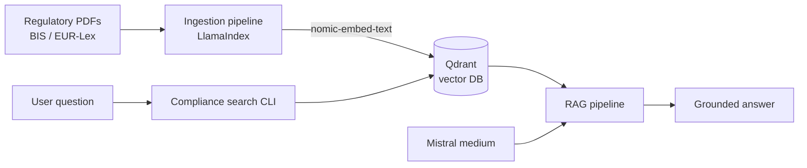

# FinTech Compliance AI Assistant

[](https://www.python.org/)
[](https://www.llamaindex.ai/)
[](https://qdrant.tech/)
[](https://microsoft.github.io/presidio/)

> Semantic search & report generation over banking regulations (Basel III, MiFID II, DORA), powered by a local-first RAG pipeline.

A financial compliance and research assistant built on an AI-powered
**Retrieval-Augmented Generation (RAG)** pipeline. It indexes large corpora of
financial regulations, contracts and reports, and lets users run
**semantic search** and produce **human-ready answers** grounded in the actual
regulatory texts.

## ✨ Features

- **Regulatory corpus ingestion** — chunk-and-embed PDFs from official sources (BIS, EUR-Lex) into a vector database
- **Semantic search CLI** — ask compliance questions in natural language, get grounded answers
- **PII anonymization** — Microsoft Presidio strips personal data from documents before/after processing (dependency included)
- **Local-first stack** — Qdrant runs in Docker, embeddings run locally via Ollama; only the LLM inference calls a hosted API (Mistral)

## 🏗️ Architecture



## 🧰 Stack

| Layer | Choice |
|---|---|
| Ingestion & retrieval | [LlamaIndex](https://www.llamaindex.ai/) |
| Embeddings | `nomic-embed-text` (local via [Ollama](https://ollama.com/)) |
| LLM | `mistral-medium` ([Mistral AI](https://mistral.ai/)) |
| Vector DB | [Qdrant](https://qdrant.tech/) — local-first, via Docker Compose |
| PII anonymization | [Microsoft Presidio](https://microsoft.github.io/presidio/) |

## 🚀 Getting Started

**Prerequisites:** Python 3.8+, Docker & Docker Compose, [Ollama](https://ollama.com/).

```bash
# 1. Clone & set up the environment
git clone https://github.com/Dredouane/fintech-compliance-ai-assistant.git
cd fintech-compliance-ai-assistant
python3 -m venv .venv && source .venv/bin/activate
pip install -r requirements.txt

# 2. Start the Qdrant vector database
docker compose up -d

# 3. Pull the local embedding model
ollama pull nomic-embed-text
```

**4. Ingest your documents** — drop PDFs into `source_documents/`
(the reference regulations are listed below), then:

```bash
python3 src/ingestion.py
```

**5. Query** — run the interactive semantic-search CLI:

```bash
python3 src/compliance_search_cli.py
```

## 📚 Reference corpus

The documents used are publicly available and sourced from official financial
regulatory bodies:

**Bank for International Settlements (BIS):**
- *Basel III* — global regulatory framework for resilient banks
- *BCBS189* — international framework for liquidity risk measurement
- *BCBS238* — the Liquidity Coverage Ratio & liquidity risk monitoring tools
- *d295* — the G-SIB framework and methodology
- *d424* — finalizing the post-crisis reforms
- *d457* — the BCBS governance and implementation report

**EUR-Lex (European Union law):**
- *Directive 2014/65/EU (MiFID II)* — markets in financial instruments
- *Regulation (EU) 2022/2554 (DORA)* — digital operational resilience for the financial sector
